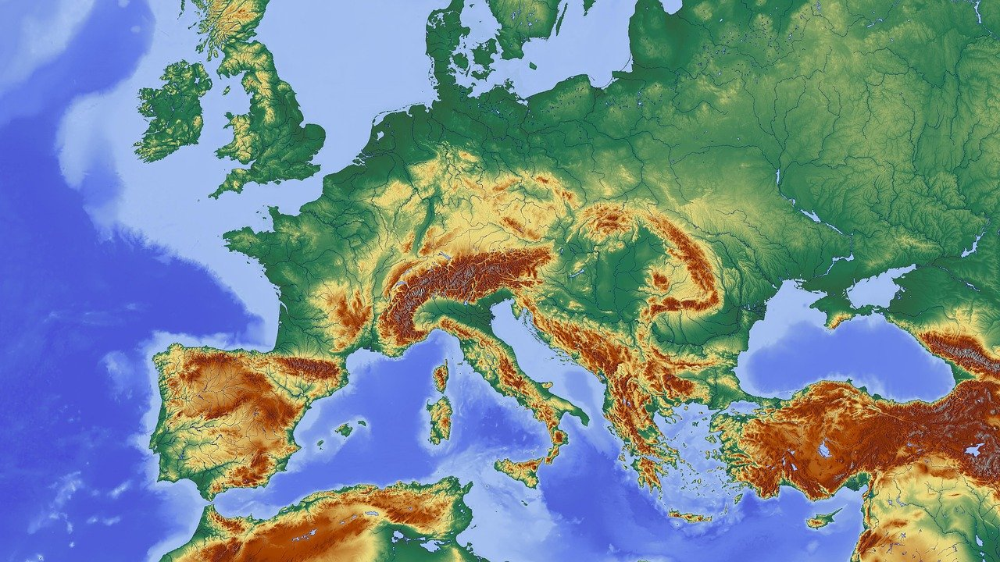

<h3 align="center">Earthquakes Around the World in the Past Week</h3>


<p align="center">
     Using leaflet and javascript to visualize earthquakes from around the world.
    <br />
    <a href="https://github.com/HsuChe/leaflet-challenge"><strong>Project Github URL »</strong></a>
    <br />
    <br />
  </p>
</p>


<!-- ABOUT THE PROJECT -->

## About The Project



Earthquakes are one of the most davastating natural disasters and tracking them is very critical to figure out how to direct resources to help people who were affected by them. 

We will be using the powerful leaflet modules to visualize earthquake activities on Earth. The data will be from the eathquake.usgs.gov API that is updated around every five minutes. We will be pulling geoJSON for activties from the past week. 

## Visualization Goals

1. We are creating three different topographies to represent the information.
2. We are using color codes and the radius of the markers to indicate the depth and magnitude of the earthquake events.
3. We are creating a toggle to add and remove the earthquake data layer from the map. 

## Importing the API to d3 and leaflet to render the map.

We are going to generate pass the geoJSON through javascript to generate the information for the application

We begin the process by create the init function and within the function we will call d3 to parse the JSON information.

```sh
d3.json(queryUrl).then(function(data){
    createFeatures(data.features.)
})

```

Next we pass the data features as a geoJSON to be rendered by leaflet. 

```sh
    var earthqueakes = L.geoJSON(earthquakeData, {
        onEachFeature: (feature, layer) => {
            layer.bindPopup( `<h3>${feature.properties.place}</h3>
        <hr>
        <p>Magnitude: ${feature.properties.mag}
        | Depth: ${feature.geometry.coordinates[2]}
        </p>
        `)
        },
        pointToLayer: (feature, latlng) => {
            return new L.circle(latlng, circleInfo(feature.properties.mag, latlng.alt))
        }
    })
```
The function will pull the relevent information for each earthquake even and render the Popup window when the marker is clicked displaying the information. 

Then it will generate the markers with circles with its radius and color based on the altitude and magnitude of the earth quake event. 

```sh 
    let circleInfo = (magnitude, alt) => {
        return {
            radius: radiusSize(magnitude),
            fillColor: colorInfo(alt),
            fillOpacity: 1,
            stroke: False
        }
    };

    let colorInfo = (alt) => {
        if (alt <= 5) {
        return '#FFCDD2';
    } else if (alt <= 12) {
        return '#E57373';
    } else if (alt <=18) {
        return '#F44336'
    } else if (alt <=24 ) {
        return '#D32F2F'
    } else if (alt <=30 ) {
        return '#FF5252'
    } else {
        return '#D50000'
        };
    };

    let radiusSize = (magnitude) => {
        return Math.pow(magnitude, 2)*500
    }
```

After the settings for the circle markers are formed, we can begin the process of rendering out the tile layers and all of the markers through leaflets.

```sh
    createMap(earthquakes);

    let createMap = (earthquakes) => {
        let map =  L.tileLayer('https://{s}.tile.openstreetmap.org/{z}/{x}/{y}.png', {
    attribution: '&copy; <a href="https://www.openstreetmap.org/copyright">OpenStreetMap</a> contributors'
        });
    let satilite = L.tileLayer('http://{s}.google.com/vt/lyrs=s&x={x}&y={y}&z={z}',{
        maxZoom: 20,
        subdomains:['mt0','mt1','mt2','mt3']
        });

    let outdoors = L.tileLayer('http://{s}.google.com/vt/lyrs=p&x={x}&y={y}&z={z}',{
    maxZoom: 20,
    subdomains:['mt0','mt1','mt2','mt3']
        });
    };
```
After the tile layers of the leaflet map is created, we can assign values to the baseMaps, overlayMaps, myMap, and controls

```sh
    let baseMaps = {
        "Satellite" : satillite,
        "Default": map, 
        "Outdoors": outdoors
    };

    let overlayMaps = {
        Earthquakes: earthquakes
    };

    let myMap = L.map("map", {
        center: [0,0],
        zoom: 2,
        layers: [map, earthquakes]
    });

    L.control.layers(baseMaps, overlayMaps, {collapsed: flase}).addTo(myMap);
```

Then we can generate the legend that defines the color codes

```sh
    let legend = L.control({position: 'bottomright'});
        legend.onAdd = (myMap) => {
            let div = L.DomUtil.create('div', 'info legend');
            let altitude = [5,12,18,24,30];
            let labels = ['Alt'];
        };

        altitude.map((element, index)) => {
            div.innerHTML += `<i style = "background: ${colorInfo(altitude[index + 1])}"> ${labels} </i> ${element}${altitude[index +1] ?}&ndash;${altitude[index + 1]}<br>:+`
        };
        return div;
    };

    legend.addTo(myMap);
```
Then we can activate the init().

